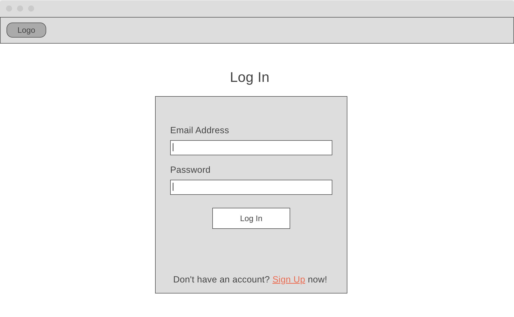
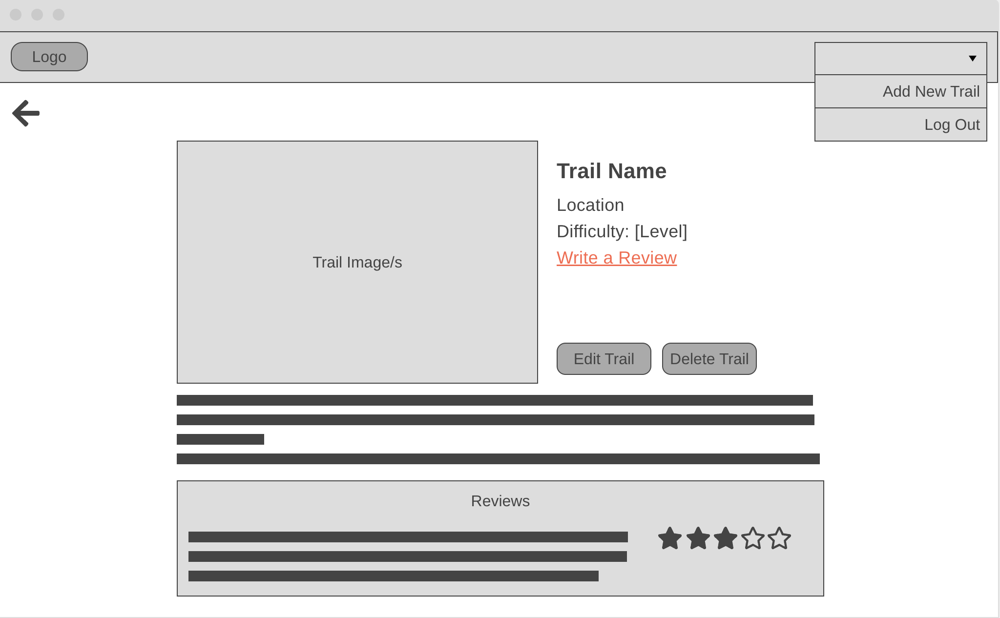
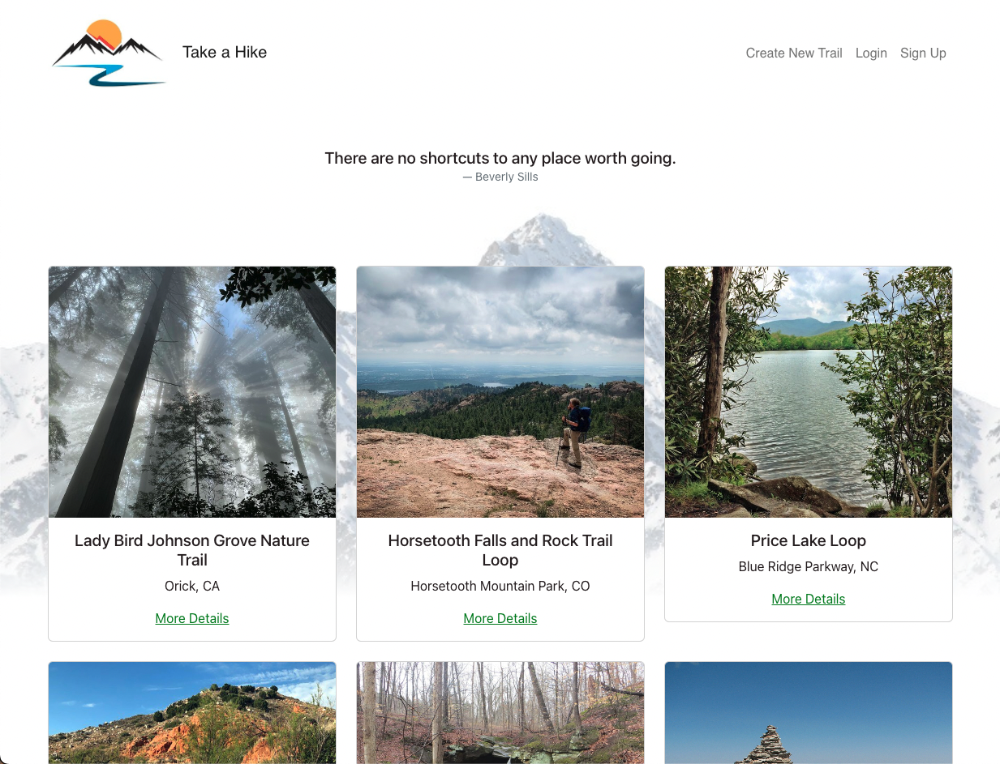
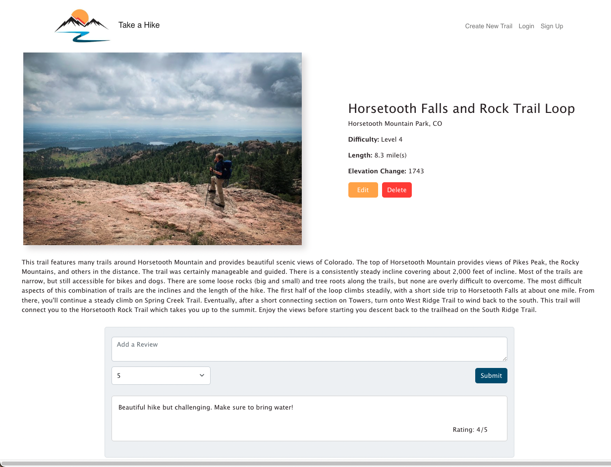
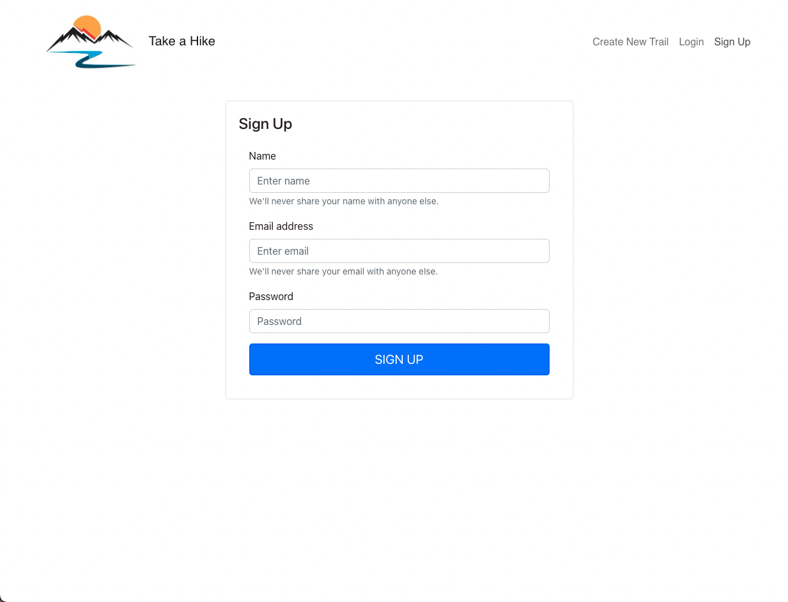
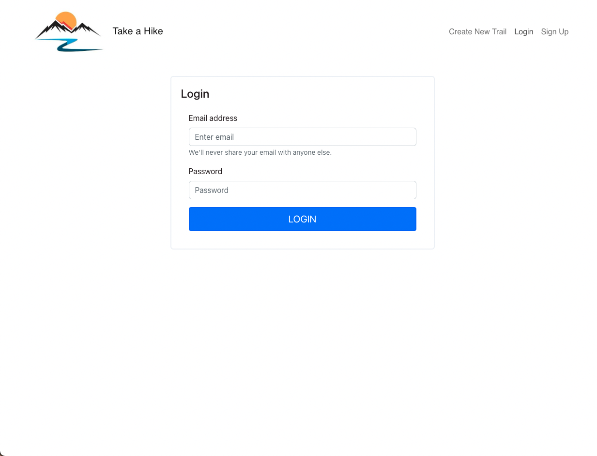
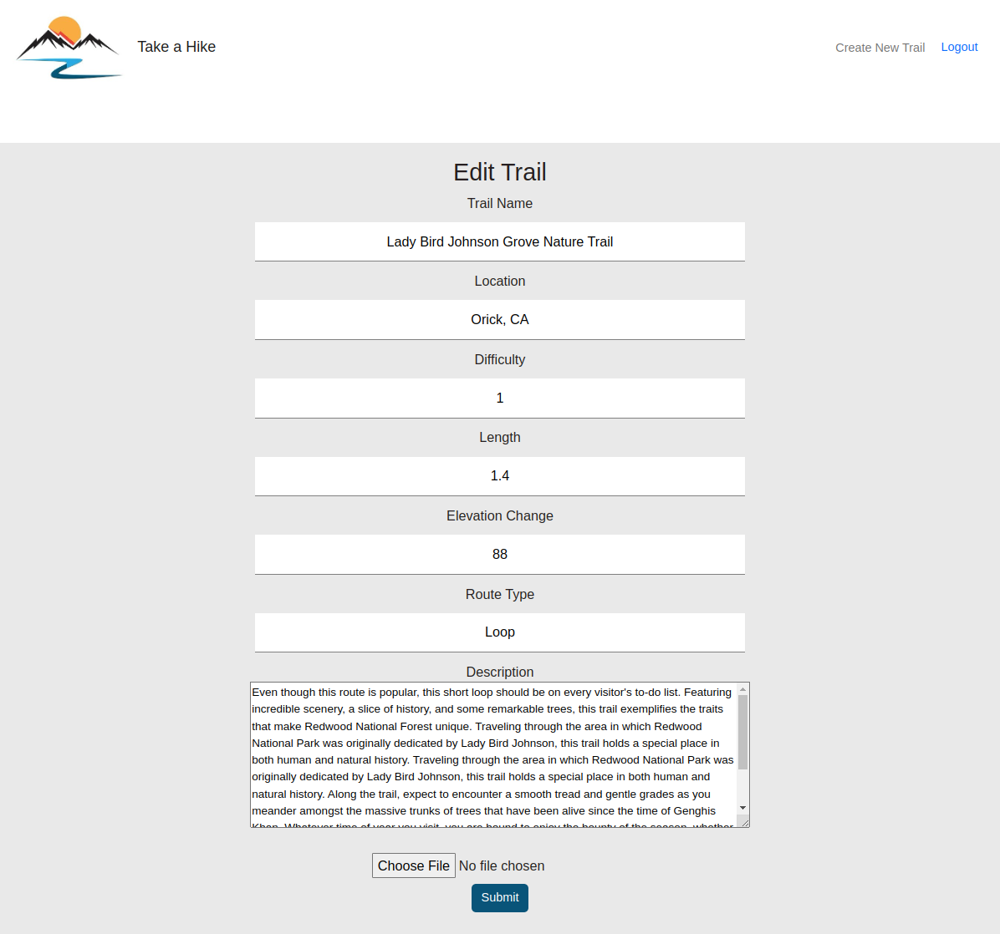

# Take a Hike 
## Project Description
Take a Hike is an app for outdoor enthusiasts to explore and manage hiking/biking trails. With the option to signup and login, users can also leave reviews for their favorite trails. 

### Project Links
#### Front-end: https://take-a-hike-dude.herokuapp.com/trails
#### Back-end: http://take-a-hike-backend.herokuapp.com/trails 

## Wireframes 
Homepage

Log In Page

Trail Details Page

## User Stories - MVP
- [x] As a user, I would like to view local hiking trails.
- [x] As a user, I would like to view details of local hiking trails.
- [x] As a user, I would like to have the option to signup/login.
- [x] As a logged in user, I'd like to edit hikes.
- [x] As a logged in user, I'd like to add new hikes.
- [x] As a logged in user, I'd like to delete hikes.
- [x] As a logged in user, I would like to add reviews of trails.
- [x] As a user, I'd like to see photos of the hikes.

## User Stories - Stretch 
- As a user, I'd like to login using Google, Facebook, or Twitter.
- As a logged in user, I would like to bookmark trails and view my favorites.
- As a user, I'd like to see a wide variety of trails in the database. 
- As a user, if I don't have a photo, I'd like there to be a default photo populated when I create a new entry.
- As a user, I'd like the ability to filter hikes by location, difficulty, and possibly other attributes.
- As a user, I would like to see the weather for hiking locations. 
- As a user, I would like to setup a profile with my name, location, photo, and reviews.

## Technologies Used 
- MERN Stack (MongoDB/Atlas, Express, React, Node.js)
- Javascript 
- Bootstrap
- CSS styled components
- Cloudinary
- Multer
- Postman
- Heroku

## Project Images
Homepage

Trail Details Page

Sign Up Page

Log In Page

Create New Trail

./public/project-images/5_newtrail.png
Edit Trail

## Known Issues 
- Need to make delete trails conditional on being logged in.
- Can add a review but the form does not clear.
- Any user can add a review not just a logged in user.
- Form styling can be more aligned.